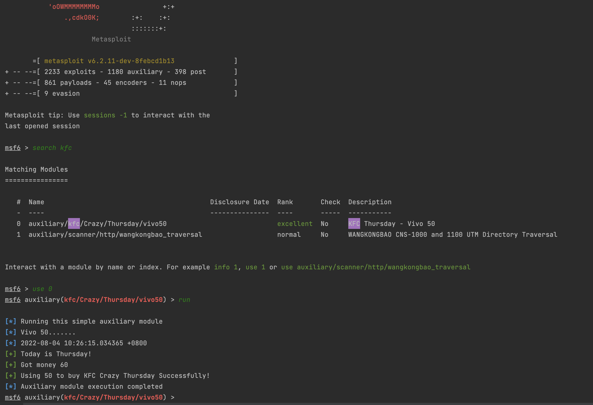

# 纯纯烂活嗷

## 使用方法

1. 将模块放入下面的位置

`~/.msf4/modules/auxiliary/kfc/crazy_thursday/vivo50.rb`

2. 打开你的 

`msfconsole`

3. 使用如下指令加载 

`loadpath ~/.msf4/modules`

4. 搜索模块 kfc

`search kfc`

5. 使用 本模块

6. run

## demo

